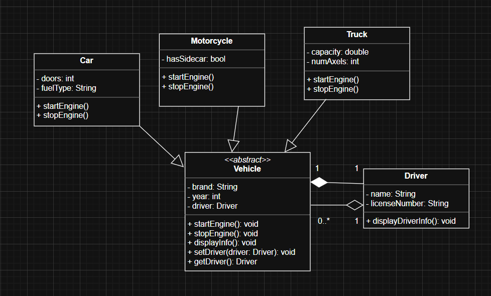
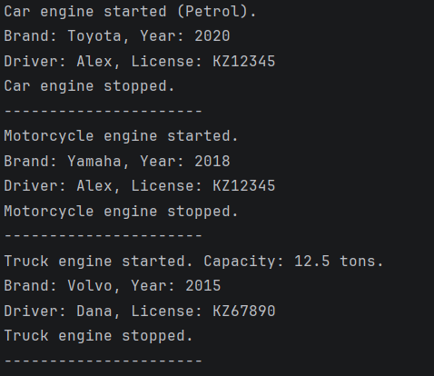

# Assignment 2: Vehicle Management System

## Project Overview
This project implements a simple **Vehicle Management System** using Object-Oriented Programming principles in Java.  
The goal of the assignment is to demonstrate **inheritance, abstraction, composition, aggregation, and method overriding**.

The system includes an abstract `Vehicle` superclass, multiple concrete subclasses, and a `Driver` class associated with vehicles.

---

## Class Hierarchy
### UML Diagram

*visual demonstration of relationships*

### Vehicle (Abstract Class)
- Fields: `brand`, `year`, `driver`
- Abstract methods:
    - `startEngine()`
    - `stopEngine()`
- Concrete method:
    - `displayInfo()`

### Subclasses
- **Car**
    - Additional fields: `doors`, `fuelType`
- **Motorcycle**
    - Additional field: `hasSidecar`
- **Truck**
    - Additional fields: `capacity`, `numAxles`

All subclasses extend `Vehicle` and override the abstract methods.

### Driver Class
- Fields: `name`, `licenseNumber`
- Method: `displayDriverInfo()`

Each `Vehicle` has a `Driver` (composition), and one `Driver` can be associated with multiple `Vehicle` objects (aggregation).

---

## Composition and Aggregation
- **Composition**:  
  Each `Vehicle` object contains a reference to a `Driver`, meaning a vehicle logically requires a driver.
- **Aggregation**:  
  A single `Driver` instance can be assigned to multiple `Vehicle` objects.

---

## How to Compile and Run
### Requirements to Compile Code Through Terminal
- Java Development Kit (JDK) must be installed on the system
- The `java` and `javac` commands must be available in the system PATH
- Commands should be executed from the directory containing the `.java` source files

Navigate to the directory containing the source (`src`) files and run:
```bash
javac *.java
java Main
```

*Alternatively, the program can be run directly from IntelliJ IDEA using the Run button in Main.java*

---

## Program Output


Screenshot demonstrating:

- Engine start and stop for different vehicle types
- Vehicle information display
- Driver information linked to each vehicle

---

## Reflection

Inheritance simplified the design by allowing common vehicle properties and behaviors to be defined once in the abstract Vehicle class and reused across subclasses. This reduced code duplication and made the system easier to extend.

Method overriding allowed each vehicle type to provide its own implementation of engine behavior while maintaining a consistent interface.
The main challenge was deciding when to use protected versus private access modifiers, especially when balancing encapsulation with subclass accessibility.